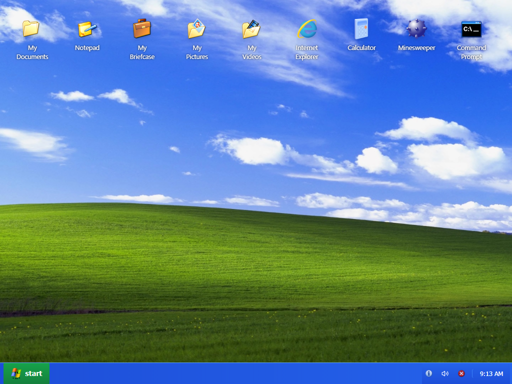

# Windows XP Replica

Proyek ini merupakan replika tampilan dan beberapa fungsionalitas dasar dari Windows XP yang dibuat menggunakan React, TypeScript, Vite, dan Tailwind CSS. Proyek ini mendemonstrasikan kemampuan untuk mereproduksi nostalgia Windows XP dengan teknologi web modern.




## Fitur

### Desktop & Taskbar
- Tampilan desktop yang mirip dengan Windows XP
- Ikon desktop yang bisa diklik
- Taskbar dengan Start Menu yang berfungsi
- System Tray dengan jam dan kontrol volume

### Window Management
- Membuka, menutup, dan minimize jendela
- Z-indexing untuk penanganan jendela yang aktif
- Drag and drop untuk memindahkan jendela
- Multi-window support

### Animasi & Sound Effect
- Animasi startup dan shutdown mirip Windows XP
- Sound effect untuk berbagai aksi (membuka/menutup jendela, notifikasi, dll)

### Aplikasi Built-in
1. **Internet Explorer**:
   - URL bar yang berfungsi
   - Tombol navigasi (back, forward)
   - Search bar untuk Google
   - Homepage dengan link populer

2. **Notepad**:
   - Penyimpanan teks menggunakan localStorage
   - Word wrap yang dapat diatur
   - Dialog "save as"
   - Pengaturan ukuran font

3. **Calculator**:
   - Operasi aritmatika dasar
   - Fungsi memori (M+, M-, MC, MR, MS)
   - Operasi tambahan (akar kuadrat, negasi, persentase)

4. **Command Prompt**:
   - Simulasi sistem file dengan direktori dan file
   - Perintah dasar DOS: dir, cd, echo, type, ver, help
   - Command history dengan navigasi menggunakan tombol panah
   - Kemampuan untuk membuka aplikasi lain (notepad, calc)

5. **Minesweeper**:
   - Game Minesweeper lengkap
   - Tiga level kesulitan (Beginner, Intermediate, Expert)
   - Timer dan penghitung mine
   - Kondisi menang/kalah yang jelas

## Teknologi yang Digunakan

- **React**: Library UI untuk membangun komponen
- **TypeScript**: Typing statis untuk JavaScript
- **Vite**: Bundler dan development server
- **Tailwind CSS**: Utility-first CSS framework
- **Shadcn/UI**: Komponen UI yang dapat digunakan kembali

## Instalasi dan Pengembangan

### Prasyarat
- Node.js (versi 14.x atau lebih baru)
- npm atau yarn

### Langkah-langkah Instalasi

1. Clone repository
```bash
git clone https://github.com/bimadevs/windows-xp-replica.git
cd windows-xp-replica
```

2. Install dependensi
```bash
bun install
```

3. Jalankan server development
```bash
bun run dev
```

4. Buka browser dan kunjungi `http://localhost:5173`

### Build untuk Production

```bash
bun run build
```

## Struktur Proyek

```
/src
  /components
    /apps             # Aplikasi built-in (IE, Notepad, dll)
    /taskbar          # Komponen taskbar, start menu
    /ui               # Komponen UI dasar (button, tabs, dll)
  /lib                # Utility dan fungsi helper
  /styles             # Global CSS dan theme
  App.tsx             # Root component
  main.tsx            # Entry point
```

## Pengembangan Lebih Lanjut

Beberapa fitur yang dapat dikembangkan:

1. Menambahkan lebih banyak aplikasi klasik Windows XP
2. Implementasi My Computer dan file explorer yang berfungsi
3. Penambahan efek visual seperti transisi antar jendela
4. Dukungan tema (biru klasik, olive green, silver)
5. Implementasi screen saver

## Kontribusi

Kontribusi sangat diterima! Silakan buat pull request atau buka issue untuk diskusi fitur baru atau perbaikan bug.

## Lisensi

[MIT License](LICENSE)

## Kredit

- Proyek ini dibuat untuk tujuan edukasi dan nostalgia
- Semua aset dan nama merk adalah milik dari pemiliknya masing-masing
- Inspired by Microsoft Windows XP

---

Dibuat dengan ❤️ dan nostalgia
